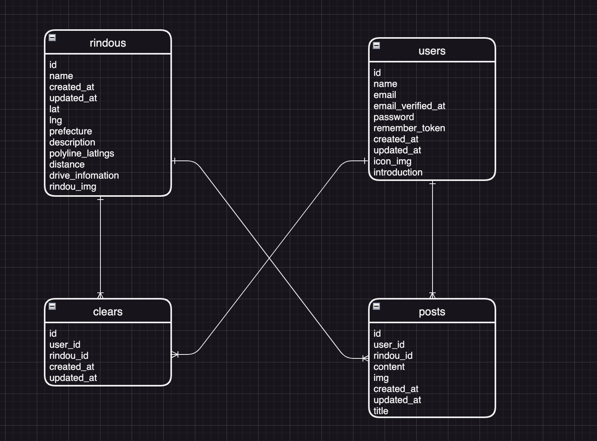

## アプリケーション名

# 林道マップ

### URL
[()]

## アプリケーション概要

マップ上で林道の位置とルートを確認できる林道検索に特化したアプリケーションです。

## このアプリケーションでできること

#### 「ユーザー登録する前」
- マップ上で林道の位置とルートを確認できる。
- 林道名を入力してマップ上で林道の位置を検索することができる。
- 都道府県ごとに林道を確認することができる。

#### 「ユーザー登録してログインした後」
- 写真や呟きを投稿することができる。
- 走行した林道を登録することができる。

## このアプリを作成した理由

- 林道に特化したマップ検索サービスがないため。
- 個人ブログをいくつも見て情報を集めるのは初心者には特に難しいため。

## 使用技術

- PHP 8.2.6
- Laravel 10.20.0
- MySQL 8.0.32
- Heroku
- Leaflet 1.9.4
- Leaflet locatecontorl
- Leaflet fullscreen
- Leaflet draw
- Leaflet markerculster
- cyberjapandata gsi
- portal cyberjapandata
- Open Street Map
- Google Maps API
- Leaflet gridlayer googlemutant
- Docker/Docker-compose
- fetch
- AWS s3

## データベース構成

